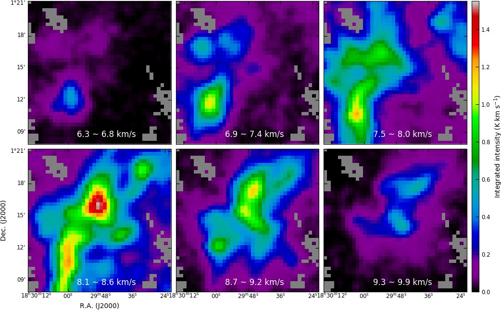
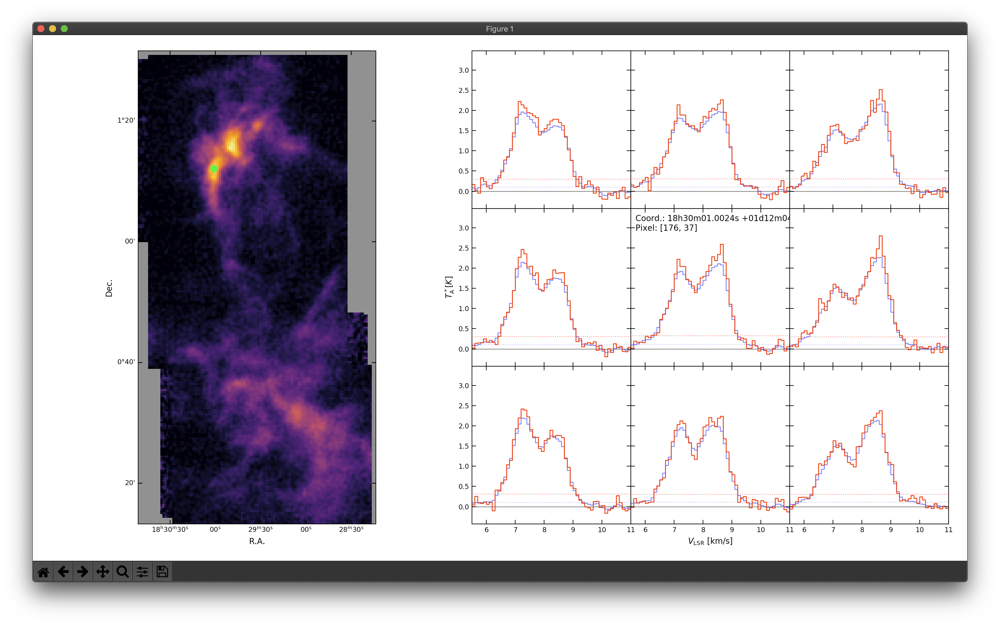
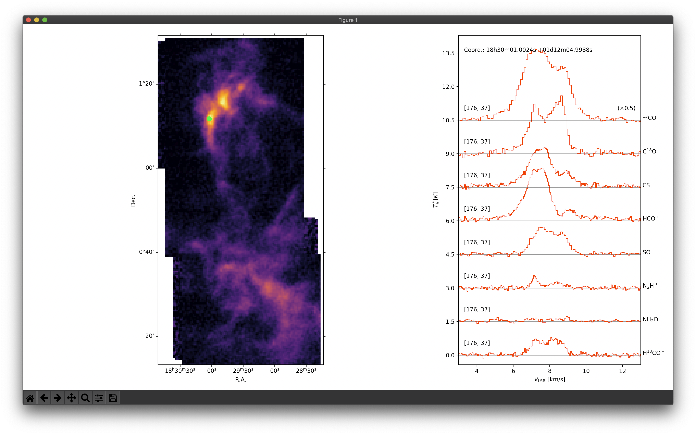
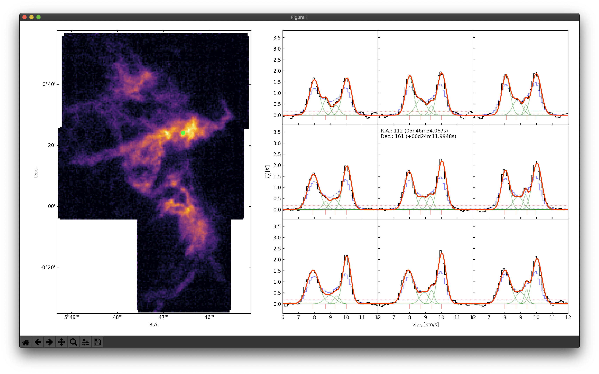

# FUNStools

`funstools` is python toolkit for FUNS project.

`funstools` is a toolkit that contains the useful functions and core tools 
needed for performing FUNS project with python. It is based on the `numpy` and 
`astropy` packages, which have been validated by astronomers for a long time.

## Install

```bash
pip install git+https://github.com/radioshiny/funstools.git
```

## Requirement

`astropy`
`matplotlib`
`scipy`

## User Manual

### RMS noise map

#### Using `get_rms`

`funstools.get_rms` returns the RMS noise map of input cube data.

```python
from funstools import get_rms
rms = get_rms(cube, where='both', size=200)
```

#### Using `Cube2map`

`funstools.Cube2map` is more useful 
to make maps including RMS noise map from cube data.

```python
from funstools import Cube2map
a = Cube2map('sample_cube.fits', getrms='both', rmssize=200, velocity_smo=2, spatial_smo=2)
rms = cube.rms
rms_smoothed = cube.srms
```

You can save maps you made to fits using `save_fits`.  
`Cube2map.header2d` is FITS header for 2d-image data.

```python
from funstools import save_fits
save_fits('rms.fits', cube.rms, cube.header2d, overwrite=True)
save_fits('rms_smoothed.fits', cube.srms, cube.header2d, overwrite=True)
```

`Cube2map.wcs2d` is 2d (RA-Dec) wcs information for matplotlib projection.

```python
from matplotlib import pyplot as plt
fig = plt.figure()
ax = fig.add_subplot(111, projection=cube.wcs2d)
ax.imshow(cube.rms, origin='lower')
fig.savefig('rms.pdf')
```

### Moments maps

#### Moment 0 (integrated intensity)

`funstools.Cube2map.moment0()` and `funstools.Cube2map.m0` 
return the integrated intensity map of input cube data.


```python
# Using velocity range
cube.moment0(vr=[v1, v2])

# Using channel range
cube.moment0(cr=[ch1, ch2])

# Return the most recently computed moment 0 map
# If there is not pre-computed moment 0 map,
#    return the moment 0 map with cr=[rmssize, -rmssize]
cube.m0

# Return with RMS_moment0
m0, m0rms = cube.moment0(verbose=True)

# Save to fits
save_fits('moment0.fits', cube.m0, cube.header2d, overwrite=True)

# Make figure
fig = plt.figure()
ax = fig.add_subplot(111, projection=cube.wcs2d)
ax.imshow(cube.m0, origin='lower', vmin=0, vmax=np.nanpercentile(cube.m0, 99.9))
fig.savefig('moment0.pdf')
```

#### Moment 1 (intensity weighted mean velocity)

`funstools.Cube2map.moment1()` and `funstools.Cube2map.m1` 
return the intensity weighted mean velocity map of input cube data.


```python
# Using channel range
cube.moment1(cr=[ch1, ch2])

# Return the most recently computed moment 1 map
cube.m1
```

#### Moment 2 (velocity dispersion)

`funstools.Cube2map.moment2()` and `funstools.Cube2map.m2` 
return the intensity weighted mean velocity map of input cube data.

^2}{M_0}})

```python
# Using channel range
cube.moment2(cr=[ch1, ch2])

# Return the most recently computed moment 2 map
cube.m2
```

#### Example script for `Cube2map.moment#()`

```python
from funstools import Cube2map
from matplotlib import pyplot as plt
from multiaxes import Multiaxes

# set baseline channel size
rs = 200

# load cube data
cube = Cube2map('/.../TRAO-FUNS/SerB/release/SerB_C18O_v10_match_cube.fits', 
                rmssize=rs, velocity_smo=2, spatial_smo=2)

# set map x-y ratio
xyr = float(cube.nr/cube.nd)

# draw figure using Multiaxes
mx = Multiaxes(2, 3, 1, xyr, 0.36, 0.56, cb=0.1, clab=0.34, scale=0.7, proj=cube.wcs2d)
mx.shareaxes((False, True), 0.1)
fig, ax, cax = mx.drawfig()

# set map title, colormap, vmin, vmax
title = [r'Integrated inteisity (K km s$^{-1}$)',
         r'Intensity weighted mean velocity (km s$^{-1}$)',
         r'Velocity dispersion (km s$^{-1}$)']
cmaps = ['inferno', 'jet', 'coolwarm']
vmin = [0., 7.3, 0.3]
vmax = [4.5, 9.8, 1.3]

# make moment maps and draw figure
map = []
for i in range(3):
    map.append(getattr(cube, 'moment{}'.format(i))())
    cmap = plt.get_cmap(cmaps[i])
    cmap.set_bad('grey')
    cmaps[i] = cmap
    cs = ax[i].imshow(map[i], cmap=cmaps[i], vmin=vmin[i], vmax=vmax[i])
    plt.colorbar(cs, cax[i], orientation='horizontal')
    cax[i].set_xlabel(title[i])
    mx.topcolorbar(cax[i])
    if i == 0:
        ax[i].coords[0].set_axislabel('R.A. (J2000)')
        ax[i].coords[1].set_axislabel('Dec. (J2000)')
    else:
        ax[i].coords[0].set_axislabel(' ')
        ax[i].coords[1].set_axislabel(' ')

# save figure
fig.savefig('images/SerB_C18O_moment_maps.png')
```

 

### Channel maps

`funstools.Cube2map.chmap()` 
return the channel maps and labels for their velocity ranges.

```python
# Using velocity range
maps, labels = cube.chmap(mn=9, vr=(vr1, vr2))

# Using channel range
maps, labels = cube.chmap(mn=9, cr=(cr1, cr2))
```

#### Example for `Cube2map.chmap()`

```python
from funstools import Cube2map
from matplotlib import pyplot as plt
from multiaxes import Multiaxes

# set baseline channel size
rs = 200

# load cube data
cube = Cube2map('/.../TRAO-FUNS/SerB/release/SerB_C18O_v10_match_cube.fits', 
                rmssize=rs, velocity_smo=2, spatial_smo=2)

# draw figure using Multiaxes
mx = Multiaxes(2, 3, 2, 1, 0.36, 0.56, margin=(0.02, 0.02, 0.71, 0.02), scale=0.7, proj=cube.wcs2d)
mx.shareaxes((True, True), 0.1)
fig, ax, _ = mx.drawfig()
cax = mx.sharecolorbar('right', 0.15, 0.1)

# set map value_range, colormap
vr = [0., 1.55]
cmap = plt.get_cmap('nipy_spectral')
cmap.set_bad('grey')

# make moment maps and draw figure
maps, labels = cube.chmap(6, (6.3, 9.9))
for i in range(6):
    iax = ax[i//3, i%3]
    cs = iax.imshow(maps[i], cmap=cmap, vmin=vr[0], vmax=vr[1])
    iax.set_xlim(26.5, 66.5)
    iax.set_ylim(163.5, 203.5)
    iax.annotate(labels[i]+' km/s', xy=(0.55, 0.05), xycoords='axes fraction', 
                 ha='center', va='baseline', color='white', fontsize='large')
    if i == 3:
        iax.coords[0].set_axislabel('R.A. (J2000)')
        iax.coords[1].set_axislabel('Dec. (J2000)')
    else:
        iax.coords[0].set_axislabel(' ')
        iax.coords[1].set_axislabel(' ')
plt.colorbar(cs, cax)
cax.set_ylabel(r'Integrated intensity (K km s$^{-1}$)')

# save figure
fig.savefig('images/SerB_C18O_channel_maps.png')
```

 

### Line scanning

`funstools.Cube2map.line_scan()` is 
the viewer of line profiles for 3 by 3 pixels.

Since the `onclick` event is activated, 
you can move a location by clicking a pixel on the left intensity map 
or clicking the direction you want to go on the right line profile map.

```python
# set the velocity range (x-axis range of plot)
cube.line_scan(vr=(5.5, 11.))
```



### Full line set scanning

`funstools.full_line_scan()` is 
the viewer of line profiles for full line sets of TRAO-FUNS.

Since the `onclick` event is activated, 
you can move a location by clicking a pixel on the left intensity map.

```python
from funstools import full_line_scan

# For the original otfpro output data
loc = '/.../TRAO-FUNS/SerB/fits/'
full_line_scan(loc, vr=(3, 13), ver='otfpro')

# For the released data
loc = '/.../TRAO-FUNS/SerB/release/'
full_line_scan(loc, vr=(3, 13), ver='release')
``` 



### Gaussian decomposing

`funstools.Decompose` is a python class that 
automatically decomposes multiple Gaussian components 
from the C<sup>18</sup>O molecular line cube data of the TRAO-FUNS observations.

```python
from funstools import Decompose

path = '/.../TRAO-FUNS/OriB1/release/'
cube = Decompose(path+'OriB1_C18O_v10_match_cube.fits',
                 rmssize=200, spasmo_find=5, velsmo_find=3, spasmo_fit=1,
                 velsmo_fit=2)
cube.run_decompose(save=path+'OriB1_C18O_decompose_result.dat')
```

* `cube` &mdash; path of input cube data.
* `ext` &mdash; extension number of fits file. 
Default is the first extension with image (2-D) data.
* `getrms` &mdash; ('left', 'right', or 'both') 
location of baseline channels to measure rms noise level.
* `rmssize` &mdash; size of baseline channels to measure rms noise level.
* `max_rms` &mdash; maximum rms level to mask noisy pixels. 
* `snr` &mdash; signal-to-noise ratio to mask undetected pixels.

`funstools.Decompose` performs 
the spatial and velocity smoothing of the input cube data in STEP 1. 
The spatial smoothing is aimed at ensuring spatial consistency 
and avoiding local fluctuations 
when estimating the number of velocity components. 
The velocity smoothing improves the signal-to-noise ratio 
by reducing the effect of noise.

* `spasmo_find` & `velsmo_find` &mdash; 
spatial and velocity smoothing factors in STEP 1

However, excessive smoothing degrades spatial and velocity resolutions 
and impairs the detail of physical and kinematic information 
presented by individual spectrum (or pixels). 
Thus, in STEP 2 and 3, 
different smoothing factors from STEP 1 are used 
to achieve the spatial continuity and signal-to-noise ratio 
at the minimum required level.

* `spasmo_fit` & `velsmo_fit` &mdash; 
spatial and velocity smoothing factors fot fitting in STEP 2 and 3

The velocity position (mean velocity) of the specific velocity component 
determined in STEP 1 needs to be maintained 
without significant change in the subsequent fitting process. 
This is because there can be countless mathematical solutions 
when decomposing a composite spectrum of velocity components 
overlapping each other with a small velocity difference. 

* `mlim` &mdash; limit of mean velocity variation in optimization

The linewidth of the individual velocity components 
also needs to be limited in an appropriate range 
as it should not be smaller than the channel width of the spectrum 
or larger than a physically possible value.

* `wmin` & `wmax` &mdash; minimum and maximum limit of FWHM of line width

In optimization process using `curve_fit`, the `bounds` key is set as ...

```python
# mi = initial guess of mean
curve_fit(..., bounds={'mean': (mi-mlim, mi+mlim), 'stddev': (wmin, wmax)})
```

`funstools.Decompose.run_decompose()` 
continuously performs the following three-step fitting 
and finally returns a table of decomposed Gaussian components.

#### STEP 1: Estimating the number of components and initial guess for fitting

The C<sup>18</sup>O molecular line spectra of the filamentary molecular clouds 
obtained from the TRAO-FUNS observations appears in the form of multiple 
velocity compoents overlapped in the line of sight. 
A minimum of one or two to a maximum of six or seven velocity components 
are identified in a spectrum 
and distributed within a narrow velocity range of 2&ndash;6 km/s. 

It is very difficult to decompose these spectra 
into multiple Gaussian components, 
especially in the case where each peak is not clearly distinguishable 
and appears as a shoulder or a skewed profile with small velocity differences. 
For reliable multiple Gaussian decomposition, 
it is particularly important to determine the following paramters.

* ***N*<sub>c</sub>** &mdash; The number of Gaussian components of each spectrum
* ***a*<sub>i</sub>**, ***m*<sub>i</sub>**, ***s*<sub>i</sub>** &mdash; 
Initial Gaussian parameters of each velocity component
    * *a*<sub>i</sub> = amplitute (or peak intensity)
    * *m*<sub>i</sub> = mean velocity (or velocity position)
    * *s*<sub>i</sub> = standard deviation (or velocity dispersion)

*N*<sub>c</sub> and initial Gaussian parameters
(*a*<sub>i</sub>, *m*<sub>i</sub>, *s*<sub>i</sub>) 
is determined by `funstools.find_comps()`.
*N*<sub>c</sub> and *m*<sub>i</sub> of each pixel is 
initially determined by `funstools.predict_peaks()` 
using the python functions of `numpy.gradient` 
and `scipy.signal.find_peaks`. 
`numpy.gradient` returns the gradient of an N-dimensional array 
and `scipy.signal.find_peaks` takes a 1-dimensional array 
and finds all local maxima by simple comparison of neighboring values 
with conditions for selecting.

```python
def predict_peaks(spectrum, rms)
    grad = -numpy.gradient(numpy.gradient(spectrum))
    peaks, _ = scipy.signal.find_peaks(grad, prominence=rms/3)
    return peaks[spectrum[peaks] > rms]
```

The initial *N*<sub>c</sub> and *m*<sub>i</sub> are adjusted 
to a value with spatial continuity via spatial smoothing. 
The initial *a*<sub>i</sub> is assumed to be 
the intensity of channel whose velocity is M in the smoothed spectrum, 
and the initial *s*<sub>i</sub> is assumed 0.2 km/s 
which is about the minimum value of the C18O line width 
measured in the TRAO-FUNS target clouds. 

The `funstools.Decompose.initial_fit()` optimizes 
this initial Gaussian parameters 
(*a*<sub>i</sub>, *m*<sub>i</sub>, *s*<sub>i</sub>) 
to accurately reproduce smoothed spectrum 
using `scipy.optimize.curve_fit` and multiple Gaussian function 
expressed as the sum of *N*<sub>c</sub> Gaussian functions.
Gaussian parameters for each velocity component of each pixel 
determined by `funstools.Decompose.initial_fit()` 
are returned as a table.

```python
# initial_fit returns a result table
fitres1 = cube.initial_fit()

# also automatically saved in Decompose.initial_fit_result
#    without assigning variable
cube.initial_fit()
fitres1 = cube.initial_fit_result
```

The resulting table has 9 columns 
(`rp`, `dp`, `tn`, `cn`, `tp`, `vp`, `sd`, `dv`, and `area`).

* `rp` &mdash; pixel coordinate in x-axis (R.A.)
* `dp` &mdash; pixel coordinate in y-axis (Dec.)
* `tn` &mdash; *N*<sub>c</sub>, total number of components in this pixel
* `cn` &mdash; order of this component in this pixel
* `tp` &mdash; *a*<sub>i</sub>, amplitute or peak intensity of this component
* `vp` &mdash; *m*<sub>i</sub>, 
mean velocity or velocity position  of this component
* `sd` &mdash; *s*<sub>i</sub>, 
standard deviation, velocity dispersion or line width of this component
* `dv` &mdash; FWHM width of this component
* `area` &mdash; Gaussian area or integrated intensity of this component

`funstools.Decompose.plot_fit()` is a simple and interactive viewer 
to scan the fitting result.

```python
cube.plot_fit(fitres1, vr=(6, 12))
```


#### STEP 2: Multiple Gaussian fitting using initial guess

Since the Gaussian parameters obtained in STEP 1 
is optimized for the smoothed spectrum, 
it still does not reproduce the original spectrum of each pixel. 
In STEP 2, multiple Gaussian fitting is again performed 
for the spectrum of each pixel with less or no smoothing 
using the result of STEP 1 as initial guess.

```python
cube.second_fit()
fitres2 = cube.second_fit_result
cube.plot_fit(fitres2, vr=(6, 12))
```


#### STEP 3: Final fitting for spatial continuity

The decomposed velocity components will not be structures 
that exist individually for each pixel, 
but rather velocity coherent structures 
that exist across many pixels. 
For a mathematically more complete solution (with minimum chi-square), 
the composite spectrum of the decomposed velocity components 
can more accurately reproduce the observed spectrum of the pixel. 
However, a solution with high spatial continuity 
is more valuable physically or kinematically, 
even if it is less perfect mathematically. 

In contrast, if the spatial continuity is too enforced 
in the decomposition process, 
it cannot be ruled out that 
false continuity that does not exist in nature 
will contaminate the decomposition result.

**The level of spatial continuity to be implemented is still under discussion.**

In STEP 3 of the current version of `funstools.Decompose`, 
an initial guess is determined 
based on the decomposition result of surrounding pixels, 
and the final multiple Gaussian fitting is performed 
using this to derive a more spatially continuous solution.

```python
cube.final_fit()
fitres3 = cube.final_fit_result
cube.plot_fit(fitres3, vr=(6, 12))
```



#### Using `Decompose.run_decompose()`

`funstools.Decompose.run_decompose()` 
sequentially performs STEP 1, 2, and 3 listed above 
and returns the final result. 
Results for each step can also be called.

```python
# excute sequentially all STEP
cube.run_decompose(save=path+'OriB1_C18O_decompose_result.dat')

# call results for each STEP
fitres1 = cube.initial_fit_result
fitres2 = cube.second_fit_result
fitres3 = cube.final_fit_result

# loading previously saved decomposing result
from astropy.io.ascii import read
fitres = read(path+'OriB1_C18O_decompose_result.dat')

# plot decomposing result
cube.plot_fit(fitres, vr=(6, 12))
```

### Finding velocity-coherent structure

(in prepareation)

### Calculating physical properties

(in prepareation)
